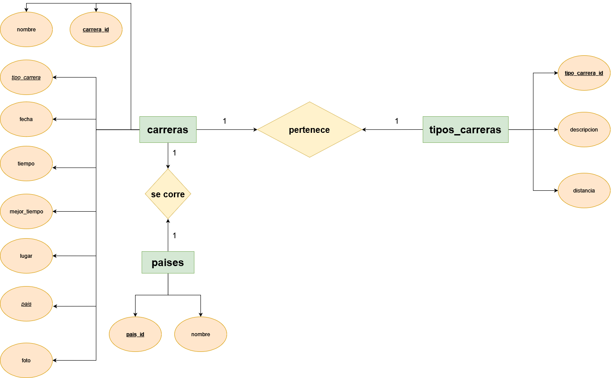
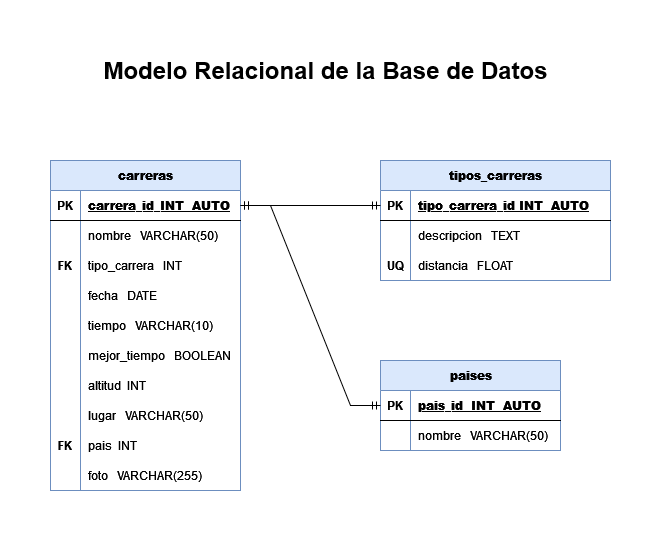

# Modelado Datos

## Pasos a seguir

1. Identificar las entidades del sistema.
2. Identificar los atributos de las entidades.
3. Identificar las llaves primarias y foráneas.
4. Asignar una nomenclatura adeacuada a las entidades y sus atributos.
5. Identificar las entidades pivote del sistema.
6. Identificar los catálogos del sistema.
7. Identificar los tipos de relaciones del sistema.
8. Crear el Modelo Entidad-Relación del sistema.
9. Crear el Modelo Relacional de la base de datos del sistema.
10. Identificar los tipos de dato de los atributos de las entidades el sistema.
11. Identificar los atributos que puedan ser únicos en el sistema.
12. Identificar las reglas de negocio (Operaciones CRUD) del sistema.

## Glosario

- **PK**: _Primary Key_
- **FK**: _Foreign Key_
- **UQ**: _Unique Attribute_
- **ED**: Entidad de Datos
- **EP**: Entidad Pivote
- **EC**: Entidad Catalogo

## Listado de Entidades

### carreras **ED**

- carrera_id **(PK)**
- nombre
- tipo_carrera **(FK)**
- fecha 
- tiempo
- mejor_tiempo
- lugar 
- pais **(FK)**
- foto

### tipos_carreras **(EC)**

- tipo_carrera_id **(PK)**
- descripcion
- distancia

### paises **(EC)**

- pais_id **(PK)**
- nombre

## Relaciones

1. Una **carrera** _pertenece_ a un **tipo de carrera**. (_1 a 1_)
1. Una **carrera se _corre_ en un **pais**. (_1 a 1_)

## Diagramas

### Modelo Entidad - Relación

### Modelo Relacional de la BD

## Reglas de Negocio

### carreras

1. Crear el registro de una carrera.
1. Leer el registro de una(s) carrera(s) dada una condición en particular.
1. Leer todos los registros de la entidad carreras.
1. Actualizar los datos de una carrera dada una condición en particular.
1. Eliminar los datos de una carrera dada una condición en particular.

### tipos_carreras

1. Todos los valores del atributo distancia, deberán estar expresados en _km_ y no se podrán repetir.
1. Crear el registro de una carrera.
1. Leer el registro de un(os) carrera(s) dada una condición en particular.
1. Leer todos los registros de la entidad tipos carreras.
1. Actualizar los datos de un tipo de carrera dada una condición en particular.
1. Eliminar los datos de un tipo de carrera dada una condición en particular.

### paises

1. Crear el registro de un país.
1. Leer el registro de un(s) país(es) dada una condición en particular.
1. Leer todos los registros de la entidad paises.
1. Actualizar los datos de un país dada una condición en particular.
1. Eliminar los datos de un país dada una condición en particular.